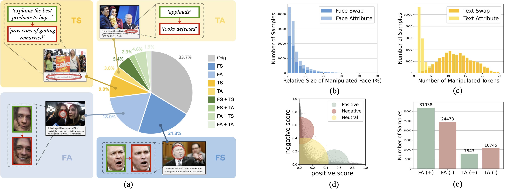
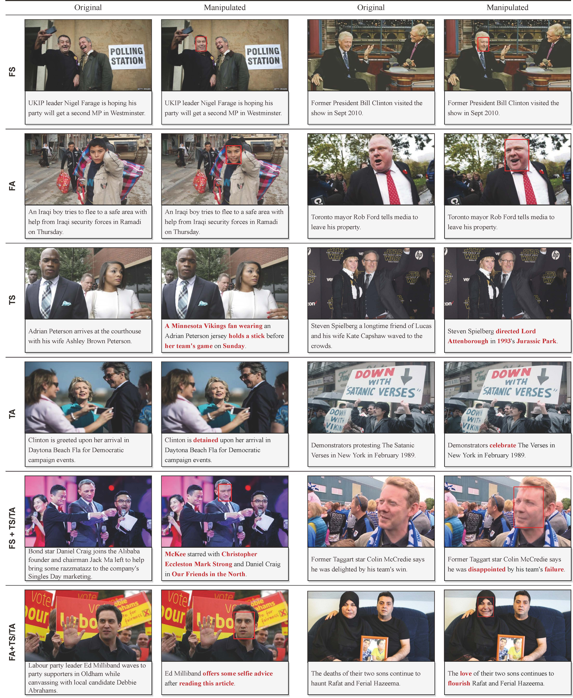

# 1、MultiModal-DeepFake PyTorch code for DGM4
## Path：MultiModalDeepFakemain\code
## Dataset Preparation

### A brief introduction
We present <b>DGM<sup>4</sup></b>, a large-scale dataset for studying machine-generated multi-modal media manipulation. 
The dataset specifically focus on *human-centric news*, in consideration of its great public influence.
We develop our dataset based on the
[VisualNews](https://github.com/FuxiaoLiu/VisualNews-Repository) dataset, and form a total of <b>230k</b> news samples, including 77,426 pristine image-text pairs and 152,574 manipulated pairs. 
The manipulated pairs contain:
- 66,722 Face Swap Manipulations <b>(FS)</b> (based on [SimSwap](https://github.com/neuralchen/SimSwap) and [InfoSwap](https://github.com/GGGHSL/InfoSwap-master))
- 56,411 Face Attribute Manipulations <b>(FA)</b> (based on [HFGI](https://github.com/Tengfei-Wang/HFGI) and [StyleCLIP](https://github.com/orpatashnik/StyleCLIP))
- 43,546 Text Swap Manipulations <b>(TS)</b> (using [flair](https://github.com/flairNLP/flair) and [Sentence-BERT](https://github.com/UKPLab/sentence-transformers))
- 18,588 Text Attribute Manipulations <b>(TA)</b> (based on [B-GST](https://github.com/agaralabs/transformer-drg-style-transfer))

Where 1/3 of the manipulated images and 1/2 of the manipulated text are combined together to form 32,693 mixed-manipulation pairs.

Here are the statistics and some sample image-text pairs:

**Dataset Statistics:**
<div align="center">

</div>

**Dataset Samples:**
<div align="center">

</div>

### Annotations

Each iamge-text sample in the dataset is provided with rich annotations. For example, the annotation of a fake media sample with mixed-manipulation type (FA + TA) may look like this in the json file:

```
{
        "id": 768092,
        "image": "DGM4/manipulation/HFGI/768092-HFGI.jpg",
        "text": "British citizens David and Marco BulmerRizzi in Australia celebrate the day before an event in which David won",
        "fake_cls": "face_attribute&text_attribute",
        "fake_image_box": [
            155,
            61,
            267,
            207
        ],
        "fake_text_pos": [
            8,
            13,
            17
        ],
        "mtcnn_boxes": [
            [
                155,
                61,
                267,
                207
            ],
            [
                52,
                96,
                161,
                223
            ]
        ]
    }
```

Where `id` is the original news-id in the VisualNews Repository, `image` is the relative path of the manipulated image, `text` is the manipulated text caption, `fake_cls` indicates the manipulation type, `fake_image_box` is the manipulated bbox, `fake_text_pos` is the index of the manipulated tokens in the `text` string (in this case, corresponding to "celebrate", "event" and "won"), and `mtcnn_boxes` are the bboxes returned by MTCNN face detector. Note that the `mtcnn_boxes` is not used in both training and inference, we just kept this annotation for possible future usage.


### Prepare data
Download the DGM<sup>4</sup> dataset through this link: [DGM4](https://huggingface.co/datasets/rshaojimmy/DGM4)

Download the pre-trained bert-base-uncased through this link: [Bert-base-uncased](https://modelscope.cn/models/AI-ModelScope/bert-base-uncased/files)

Then download the pre-trained model through this link: [ALBEF_4M.pth](https://storage.googleapis.com/sfr-pcl-data-research/ALBEF/ALBEF_4M.pth) (refer to [ALBEF](https://github.com/salesforce/ALBEF))

You can download the best HAMMER-PLUS model through this link: [HAMMER](https://pan.baidu.com/s/1xf3Nl_xifYMNAr-QOEnWxg提取码：ozjo)

Put the dataset into a `MultiModalDeepFakemain` folder at the same root of `./code`, put the `results` and `pre-trained bert-base-uncased`  into `MultiModalDeepFakemain/code`. and put the `ALBEF_4M.pth` checkpoint into `MultiModalDeepFakemain/code/`. After unzip all sub files, 
the structure of the code and the dataset should be as follows:


```
MultiModalDeepFakemain
├── code
│  ├── configs
│  │   
│  ├── results
│  │   └──...
│  ├── models
│  │   └──...
│  ├── bertbaseuncased
│  │   └──...
│  ...
│  └── ALBEF_4M.pth..
└── datasets
    └── DGM4
        ├── manipulation
        │   ├── infoswap
        │   |   ├── ...
        |   |   └── xxxxxx.jpg
        │   ├── simswap
        │   |   ├── ...
        |   |   └── xxxxxx.jpg
        │   ├── StyleCLIP
        │   |   ├── ...
        |   |   └── xxxxxx.jpg
        │   └── HFGI
        │       ├── ...
        |       └── xxxxxx.jpg
        ├── origin
        │   ├── gardian
        │   |   ├── ...
        |   |   ...
        |   |   └── xxxx
        │   |       ├── ...
        │   |       ...
        │   |       └── xxxxxx.jpg
        │   ├── usa_today
        │   |   ├── ...
        |   |   ...
        |   |   └── xxxx
        │   |       ├── ...
        │   |       ...
        │   |       └── xxxxxx.jpg
        │   ├── washington_post
        │   |   ├── ...
        |   |   ...
        |   |   └── xxxx
        │   |       ├── ...
        │   |       ...
        │   |       └── xxxxxx.jpg
        │   └── bbc
        │       ├── ...
        |       ...
        |       └── xxxx
        │           ├── ...
        │           ...
        │           └── xxxxxx.jpg
        └── metadata
            ├── train.json
            ├── test.json
            └── val.json

```


## Training
cd MultiModalDeepFakemain/code
Modify `train.sh` and run:
```
sh train.sh
```

You can change the network and optimization configurations by modifying the configuration file `./configs/train.yaml`.


## Testing
cd MultiModalDeepFakemain/code
Modify `test.sh` and run:
```
sh test.sh
```
# 2、Ten Words Only Still Help:* Improving Black-Box AI-Generated Text Detection via Proxy-Guided Efficient Re-Sampling
## Path：POGERmain
## Datasets
The binary, multiclass and OOD AIGT datasets are available at [Google Drive](https://drive.google.com/drive/folders/1xxdjZedn7le_P1HunCDF_WCuoFYI0-pz?usp=sharing).
## pre-trained model
Download the pre-trained roberta-base through this link: [roberta-base](https://huggingface.co/FacebookAI/roberta-base/tree/main)

You can Download the best-trained model through this link: [POGER](https://pan.baidu.com/s/1LARvuzHD0phivBw_8FfIyw提取码：gbk)

Put the best-trained model into  `POGERmain/POGER/params`.

## Run
### 1. Preprocess
#### Obtain POGER Features

``` shell
cd POGERmain/get_feature
export HF_TOKEN=hf_xxx        # Fill in your HuggingFace access token
export OPENAI_API_KEY=sk-xxx  # Fill in your OpenAI API key

python get_poger_feature.py \
    --n 100 \
    --k 10 \
    --delta 1.2 \
    --input ../data/binary/train.jsonl \
    --output ./train_poger_feature.jsonl
python get_poger_feature.py \
    --n 100 \
    --k 10 \
    --delta 1.2 \
    --input ../data/binary/test.jsonl \
    --output ./test_poger_feature.jsonl
```

#### Obtain POGER-Mixture Features
##### Inference on white-box LLMs

``` shell
cd POGERmain/get_feature/get_true_prob
#多个线程gpu
# Launch inference server
nohup python backend_api.py --model gpt2 --gpu 0 --port 6001 &
nohup python backend_api.py --model gptj --gpu 0 --port 6002 &
nohup python backend_api.py --model llama2 --gpu 1 --port 6003 &
nohup python backend_api.py --model alpaca --gpu 2 --port 6004 &
nohup python backend_api.py --model vicuna --gpu 3 --port 6005 &

# Get true probability
python get_true_prob.py
```

##### Mixing true probability and estimated probability

``` shell
cd POGERmain/get_feature

python get_poger_mix_feature.py \
    --poger-feature ./train_poger_feature.jsonl \
    --true-prob ./get_true_prob/result/train_true_prob.jsonl \
    --output ./train_poger_mix_feature.jsonl
python get_poger_mix_feature.py \
    --poger-feature ./test_poger_feature.jsonl \
    --true-prob ./get_true_prob/result/test_true_prob.jsonl \
    --output ./test_poger_mix_feature.jsonl
```

### 2. Train
``` shell
cd POGERmain/POGER

# POGER
python main.py \
    --cuda \
    --model poger \
    --data-dir ../get_feature \
    --data-name full_data

## POGER-Mixture
python main.py \
    --cuda \
    --model poger_mix \
    --data-dir ../get_feature \
    --data-name full_data
```

[//]: # (python main.py --cuda --model poger --data-dir ../get_feature --data-name full_data)
### 3. Test
``` shell
cd POGERmain/POGER

# POGER
python main.py \
    --cuda \
    --model poger \
    --data-dir ../get_feature \
    --test ./params/params_poger_full_data.pt
# POGER-Mixture
python main.py \
    --cuda \
    --model poger_mix \
    --data-dir ../get_feature \
    --test ./params/params_poger_mix_full_data.pt

```

# 3、SeqXGPT
## Path：SeqXGPT
## Datasets

The dataset is divided into Chinese and English datasets, and in each dataset, they are organized into different files based on the sources of AI generated sentences in the documents. You can refer to the requirements of different tasks in this article to arrange and merge files. 
You can download the SeqXGPT dataset through the following link:[SeqXGPT](https://pan.baidu.com/s/1iqOBFjVtn3S1kQ-mqsq3kQ提取码：0wbf)

Unzip the dataset.Put the dataset into  `SeqXGPT/dataset`.
 

## Inference Server

We use four open-source (L)LMs to construct the original features of our SeqXGPT and the contrastive features for Sniffer: GPT2-xl (1.5B), GPT-Neo (2.7B), GPT-J (6B) and LLaMA (7B). For each model, we set up an inference server specifically for extracting perplexity lists.

You can launch the inference server through `backend_api.py`. The startup command is as follows:

```bash
cd SeqXgpt
# --model: [gpt2, gptneo, gptj, llama, t5]

python backend_api.py --port 6006 --timeout 30000 --debug --model=gpt2 --gpu=0
```
## Best Model
You can Download the best-trained model results through this link:

中文AIGC检测[SeqXGPTcn](https://pan.baidu.com/s/1LmqOoLYGzIkSdxSf6eEsjw提取码：o8yi)、

非中文AIGC检测[SeqXGPTncn](https://pan.baidu.com/s/18hN8VUiJvS_xg013_zBqHA提取码：vbtx)

Put the best-trained model into  `SeqXGPT`.
## Feature Extraction

After successfully starting the related inference server, you can extract **the original features of SeqXGPT** using `gen_features.py`:

```bash
python SeqXGPT/dataset/gen_features.py --get_en_features --input_file input.jsonl --output_file output.jsonl
```

**It's worth noting that** you need to modify the inference server's URL in this file to the URL of the server you started.

You can extract **the contrastive features for Sniffer** using:

```bash
python SeqXGPT/dataset/gen_features.py --get_en_features --input_file input.jsonl --output_file output_1.jsonl
```

```bash
python SeqXGPT/dataset/gen_features.py --process_features --input_file output_1.jsonl --output_file output_2.jsonl
```

## Models

### SeqXGPT

We have provided the **complete code** for the model, dataloader, and train/test-related function under the `SeqXGPT` folder.

Before training and testing, please refer to the [Feature Extraction](#feature-extraction) section to extract relevant features, which will serve as the `--data_path`. The reference command is as follows:

```bash
# split train / test dataset and then train. You can adjust the train/test ratio using '--train_ratio'.
python SeqXGPT/SeqXGPT/train.py --gpu=0 --split_dataset

# train
python SeqXGPT/SeqXGPT/train.py --gpu=0

# test
python SeqXGPT/SeqXGPT/train.py --gpu=0 --do_test

# test document-level AIGT detection
python SeqXGPT/SeqXGPT/train.py --gpu=0 --do_test --test_content
```